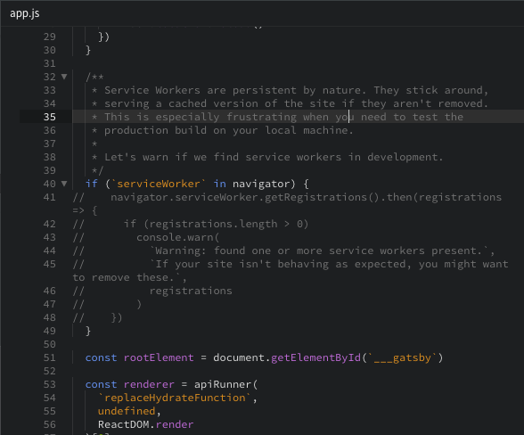

# How-tos and regularly used commands 

## Crucial Commands

### From the original documentation

`$ gatsby develop`

Run the project locally with live reload in development mode.

`$ gatsby develop - - verbose`


Safe-mode-ish environment, ignores some errors, worked when above wasn't 

`$ npm run build` oder `$ gatsby build`

Run a production build into `./public`. The result is ready to be put on any static hosting you prefer.

### For developement environment

`$ ./develop_init.sh`

Remove cache and rerun gatsby develop (cache needs to be deleted to see changes made on Contentful)

`$ sass --watch src/styles/panke.scss:src/styles/panke.css`

Couldn't get SASS running with Gatsby v1. Watch creates css in Terminal independetly from React. Executed from root folder

## Git cheat sheet

Good tutorial: https://nvie.com/posts/a-successful-git-branching-model/

### Create branches

#### In Terminal:

```
# Create branch:
$ git checkout -b XXX

# Push branch:
$ git push

# then follow instruction and create branch online:
e.g. $ git push --set-upstream origin XXX
```

#### In Brackets 

Create branch from old branch in Brackets · **Dont' select origin but the simple local one**

### Merge branches

When merging branches, merge XXX-new into YYY-old(master).

```
$ git checkout YYY-old

$ git merge --no-ff XXX-new -m "Merge message"

```

### Set tags (versioning releases)

Set tags after commit and push tags

```
$ git tag v1.0

$ git push --tags
```

### Skip netlify build

Add `[skip ci]` anywhere in commit message


## Find/Replace Cheat Sheet

### Git merge conflict

Find `(<<<<<<< \w+)([\W\w\n\r\t]*?)(\n=======\n)([\W\w\n\r\t]*?)(>>>>>>> \w+\n)` replace by `$4`

## Error workarounds

### Firefox Websocket security issue

When facing this error:


Close with **X** on top right or add this workaround in *.cache/app.js*



